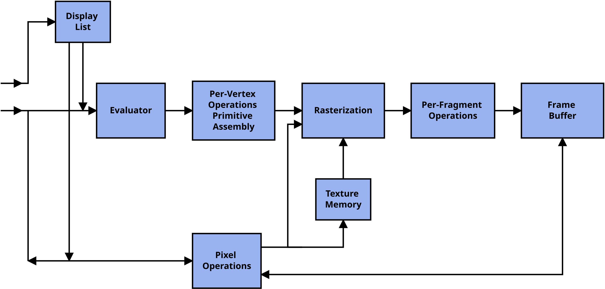

# GFX_Learn

这是一个图形学学习笔记和示例代码仓库，包含了OpenGL、Wayland等图形技术的学习资料和实践项目。

## 目录结构

- `opengl_basics/` - OpenGL基础示例代码
- `wayland_egl_app/` - Wayland EGL应用示例
- `qt_wayland_app/` - Qt Wayland应用示例
- `learning_plan/` - 学习计划文档
- `images/` - 文档中使用的图片资源

## 学习内容

### OpenGL
- 基础窗口创建与管理
- 图形渲染流水线
- 着色器编程
- 纹理映射
- 3D变换与相机控制
- 光照与材质系统

### Wayland
- Wayland EGL编程
- Qt Wayland应用开发

## 学习计划

详细的OpenGL学习计划位于 `learning_plan/` 目录下，包含了从基础到高级的系统学习路径。

## 示例代码

每个目录下都有相应的示例代码和README说明文档，可以按照学习计划逐步学习和实践。

